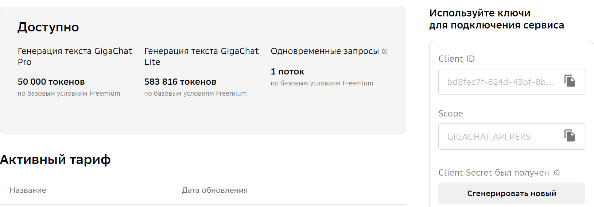

# Получение токена для работы с GigaChat

# Инструкция для пользователей

Переходим по данной ссылке ((https://developers.sber.ru/docs/ru/gigachat/individuals-quickstart?tool=python#shag-2-poluchenie-tokena-dostupa)) и действуем по инструкциям:

Необходимо полностью выполнить шаг 1, пока не увидите следующую информацию: 

Нажимаем сгенерировать новый или просто сгенерировать, если первый раз, и оттуда копируем ‘Авторизационные данные’. Именно эта информация является нужным token - его подаем на вход функции.

Следующие шаги 2 и 3 можно пропустить, так как этот вид доступа пока не работает, точнее сам сайт где должны быть модели: https://gigachat.devices.sberbank.ru/api/v1/chat/completions.

Но можно использовать шаг 4 для запуска GigaChat – там нужны только ‘Авторизационные данные’